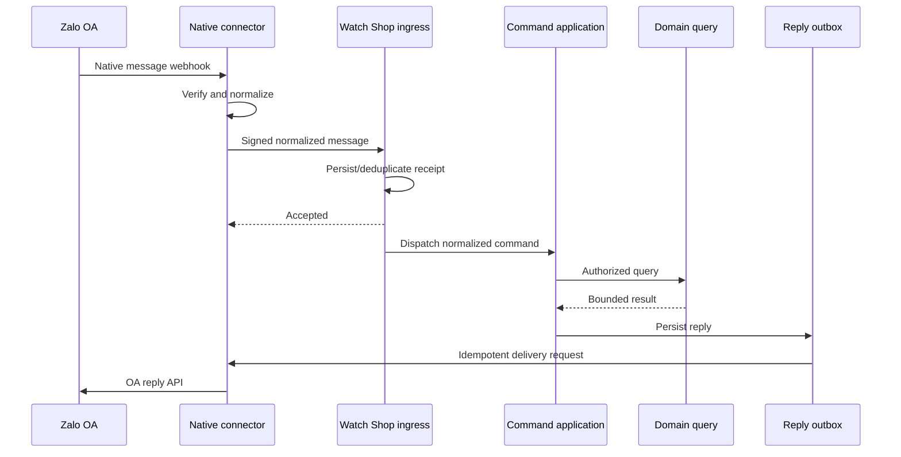
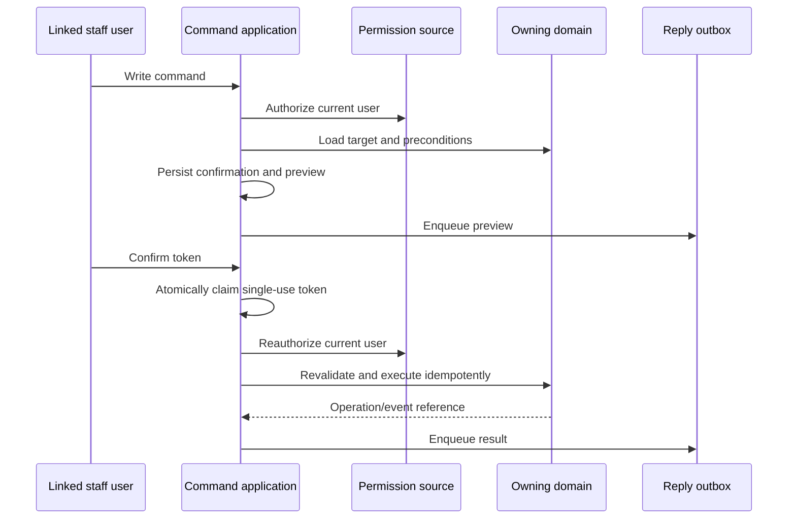

# ADR-004: Zalo Command Channel Boundary

Status: Proposed

Date: 2026-10-08

Decision owners: Watch Shop owner and implementation reviewer

## Context

Watch Shop currently has two Zalo-related capabilities with different trust
boundaries:

- `POST /api/integrations/zalo/events` accepts a Watch Shop-owned HMAC envelope
  containing `watch.lookup` or `order.create` events;
- the Notification domain refreshes an OA token and sends text messages to a
  configured Zalo group.

The inbound route is an authenticated connector API, not a native Zalo OA
webhook. It verifies a five-minute timestamp window and a body-bound HMAC,
persists `IntegrationIngressReceipt`, and calls the existing public catalog or
public order application service. The receipt provides event replay protection,
but it is not a conversation, command execution, confirmation, or reply-delivery
record.

The outbound client is specialized for the OA group-message endpoint. It sends
inside Notification delivery processing and does not provide the durable reply
outbox, direct-conversation addressing, or inbound-message correlation required
by a command channel.

Current official Zalo documentation confirms that OA supports two-way
interaction, messages, group chat, and webhooks. Exact native webhook signature,
event, reply, button, eligibility, and response-window contracts are controlled
by the target OA/app configuration and must be captured from the current
authenticated Zalo developer console before native-adapter implementation. No
production code may infer those contracts from historical examples.

This ADR proposes the trust boundary, identity policy, conversation policy,
confirmation protocol, and reply ownership for the command channel. It does not
authorize production configuration, schema migration, or deployment.

## Decision

### 1. Preserve the owned connector boundary

Use a separately deployed native Zalo connector as the first production
integration shape:

```text
Zalo OA
  -> external native connector
  -> verify native authenticity and normalize provider payload
  -> Watch Shop owned HMAC ingress
  -> command application services
  -> durable reply outbox
  -> connector delivery API
  -> Zalo OA
```

The connector and Watch Shop contract must be independently versioned. Native
Zalo payloads, signatures, tokens, and provider retry details do not enter
Storefront, Order, or other business domains.

Reasons:

- the existing HMAC boundary is deployed and already has key rotation, body
  integrity, timestamp validation, and replay primitives;
- native provider-contract changes remain isolated from business services;
- the public Watch Shop application does not need to own OA credentials or
  provider verification code;
- a connector can acknowledge native webhooks quickly and retry the internal
  call without coupling Zalo's response window to domain work.

A direct native route in Watch Shop remains a future option. It requires a
separate ADR amendment with the verified provider contract and equivalent
credential isolation, replay protection, and acknowledgement behavior.

### 2. Introduce a versioned command ingress beside the legacy events

Keep the current `watch.lookup` and `order.create` event schema compatible.
Add a versioned normalized message contract rather than widening the existing
discriminated union with provider-specific fields.

The normalized contract must include bounded values for:

- connector event and message IDs;
- OA/account, sender, and conversation IDs;
- direct or group conversation kind;
- sent timestamp and supported interaction kind;
- normalized text or versioned callback payload;
- reply context when available;
- connector contract version.

Raw provider payloads, access tokens, signatures, display names, avatars, and
phone numbers are excluded. The connector may retain a short-lived sanitized
diagnostic record under its own retention policy.

### 3. Keep command orchestration out of Storefront

Create a Zalo command application boundary under a dedicated integration
domain. It owns parsing, registry policy, execution state, identity resolution,
confirmation, reply rendering, and reply enqueueing.

Business reads and writes remain owned by their existing domains. A command
handler calls the same public application service or permission-checked domain
command used by the equivalent application surface. It must not write business
tables directly.

### 4. Use direct conversations for identity and sensitive operations

Proposed conversation policy:

| Capability | Direct conversation | Group conversation |
|---|---:|---:|
| `/help` | Allowed | Allowed, minimal response |
| Public `/watch` | Allowed | Allowed, public fields only |
| Public `/order` | Allowed | Denied; direct-message handoff |
| `/link` and `/unlink` | Allowed | Denied |
| Staff reads | Allowed with permission | Denied by default |
| Staff writes and confirmation | Allowed with permission | Denied |

Group messages must never contain customer identity, contact details, payment
amounts, addresses, internal notes, linking codes, or confirmation tokens.
Changing any group policy requires an explicit command-registry change and a
redaction test.

### 5. Link identity with a single-use Admin-issued code

Only an authenticated Admin user may create a link code for their own active
Watch Shop user. The code is random, short-lived, stored as a hash, single-use,
and atomically bound to the OA identity that submits `/link` in a direct
conversation.

Authorization always resolves the linked internal user at execution time. A
disabled user, expired code, revoked link, OA mismatch, or duplicate active link
fails closed. Zalo profile data is not an authorization source.

Initial policy allows one active Zalo identity per internal user and one active
internal user per `(oaId, zaloUserId)`. Re-linking requires explicit revocation.

### 6. Require durable confirmation for every sensitive write

The confirmation flow is:

```text
prepare
-> authorize
-> validate target
-> persist payload hash, target version, preview, and expiry
-> send preview
-> receive confirmation
-> consume token atomically
-> reauthorize and revalidate
-> execute canonical domain command idempotently
-> record result and enqueue reply
```

Confirmation records expire after five minutes by default. Tokens are random,
stored as hashes, single-use, and bound to OA, sender, direct conversation,
linked user, normalized command payload, and target/version. The token is not a
permission grant. Permission and business state are checked again immediately
before execution.

### 7. Give replies a dedicated transactional outbox

Command replies are not `NotificationChannelDelivery` records. Notification
deliveries represent event-driven configured recipients; command replies have
different addressing, privacy, ordering, idempotency, and recovery semantics.

The command transaction persists execution state and a reply-outbox row. A
worker claims replies with leases, sends through a connector adapter, records a
sanitized provider reference, and retries transient errors with bounded
backoff. Permanent failures remain visible for manual investigation. Manual
retry is permitted only when the idempotency key and provider behavior make it
safe.

### 8. Default all command capabilities off

Use a global kill switch plus per-command switches. A disabled command performs
no domain call and returns a safe unavailable response when replies are
operational. Milestone rollout starts with an allow-listed test connector and
test OA. Merge does not enable a command or authorize a deployment.

## Required persistence boundaries

The implementation may refine names during schema review, but it must preserve
these distinct semantics:

- inbound message receipt and deduplication;
- command execution and state transitions;
- identity link and link-code lifecycle;
- confirmation session and atomic consumption;
- reply outbox delivery and retry state.

`IntegrationIngressReceipt` may be generalized only if its existing connector
semantics and compatibility are preserved. `NotificationDispatch` and
`NotificationChannelDelivery` must not be overloaded for command replies.

All migrations are additive and backward compatible with the previously
deployed application.

## Sequence diagrams

### Read command



### Confirmed write command



## Threat model

| Threat | Required control |
|---|---|
| Forged native webhook | Connector verifies the current official contract before normalization |
| Forged connector request | Rotatable key ID, HMAC over method/path/body hash, bounded clock skew |
| Provider or connector replay | Unique provider message/event ID plus existing nonce replay protection |
| Duplicate domain mutation | Execution idempotency key passed to the canonical domain command |
| Stolen or guessed link code | High entropy, hashed storage, short expiry, attempt limit, atomic consumption |
| Zalo identity impersonation | Identity comes only from verified connector fields; profile data grants nothing |
| Group data disclosure | Registry deny-by-default and response-field redaction tests |
| Confirmation theft or reuse | Sender/conversation/payload binding, hash storage, expiry, atomic single use |
| TOCTOU between preview and write | Reauthorization and target-version/precondition check at confirmation |
| Credential leakage | Secrets excluded from payload persistence and logs; connector/OA credentials separated |
| Retry storm or abuse | Limits by connector, sender, conversation, command, and IP where trustworthy |
| Worker crash after send | Stable delivery idempotency key and reconciliation of leased deliveries |
| Compromised linked account | Immediate revoke/disable, audit trail, global/per-command kill switches |
| Stored sensitive data exposure | Data minimization, bounded errors, retention cleanup, Admin access checks |

## Audit findings and implementation constraints

1. `zalo-ingress-auth.ts` is suitable only for the owned connector contract;
   its name must not imply native OA verification.
2. `IntegrationIngressReceipt` deduplicates `(channel, nonce)` and
   `(channel, eventId)`, but its synchronous stale-retry behavior is not a
   durable command worker or message history.
3. `zalo-ingress.service.ts` correctly delegates to public services. New
   handlers should retain this domain-ownership pattern.
4. `zalo.client.ts` uses one configurable group-message endpoint and retries
   after token expiry. Direct replies need a separate typed adapter instead of
   changing the meaning of `sendZaloTextToGroup`.
5. OA token metadata currently resides in `SystemJobControl`. Secret-storage
   hardening is a separate review gate; command work must not expose metadata
   through operational APIs.
6. Existing receipt expiry has no demonstrated cleanup job. Retention work is
   required before introducing higher-volume inbound message rows.

## Consequences

Positive:

- provider details are isolated from business domains;
- existing connector clients remain compatible;
- identity, execution, confirmation, and delivery have auditable lifecycles;
- sensitive commands fail closed in groups and on stale authorization;
- a provider outage does not hold a business transaction open.

Trade-offs:

- the connector is an additional deployable component with its own monitoring;
- replies require a second versioned connector contract;
- identity linking and durable outbox work precede staff commands;
- native contract acceptance needs access to the target Zalo developer console
  and test OA.

## Approval gates

Before this ADR becomes `Accepted`, the owner must approve:

1. external connector first, rather than a direct native Watch Shop route;
2. direct-only policy for linking, staff reads, orders, and all writes;
3. one-to-one identity-link cardinality;
4. five-minute confirmation expiry;
5. target test OA/connector and retention periods.

Before Milestone 1 code begins, attach sanitized evidence for the current
official native webhook and reply contracts, including response deadline,
signature inputs, retry rules, message IDs, supported conversation addressing,
and button/callback availability.

## Verification

Milestone 0 is documentation-only. Review must confirm that:

- every proposed component has one owner and does not bypass a domain service;
- each trust transition has authentication and replay controls;
- every write path includes confirmation, reauthorization, state revalidation,
  idempotency, audit, and reply enqueueing;
- no proposed group response contains sensitive data;
- production remains gated by an explicitly authorized `production-*` tag.
